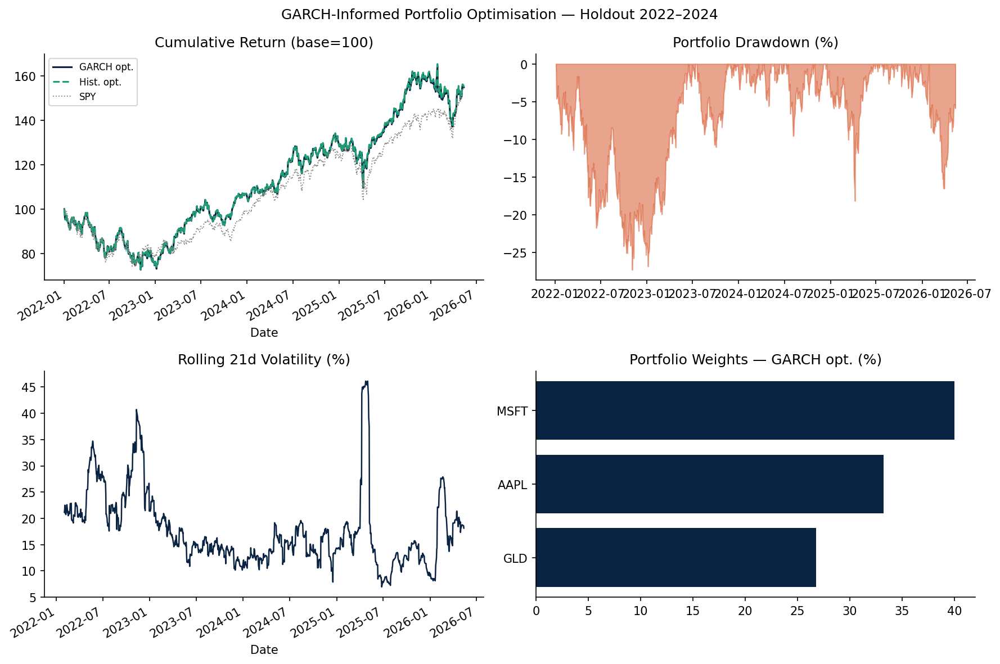

# GARCH-Informed Portfolio Optimisation

**MSc Quantitative Finance - Personal Project**

---

## What This Is

A study into whether replacing static historical covariance with **GARCH(1,1)-implied conditional volatility** improves the risk-adjusted performance of a mean-variance optimised portfolio.

Standard Markowitz uses historical covariance, which treats all past data equally and is slow to adapt during volatility spikes. GARCH captures the fact that high-vol days tend to cluster - so forecasted covariance reflects current market conditions better.

---

## Method

**Universe:** AAPL, MSFT, JPM, JNJ, XOM, GLD, SPY, BND  
**Period:** 2018–2024 | **Rebalancing:** Monthly | **Benchmark:** SPY

1. Download adjusted close prices, compute daily log returns
2. Fit GARCH(1,1) per asset: $\sigma_t^2 = \omega + \alpha\epsilon_{t-1}^2 + \beta\sigma_{t-1}^2$
3. Forecast 10-day conditional volatility; build implied covariance: $\Sigma_{ij} = \rho_{ij} \cdot \hat\sigma_i \cdot \hat\sigma_j$
4. Maximise Sharpe ratio using both GARCH and historical $\Sigma$ - compare results
5. Backtest with 10bps transaction cost; compute VaR, CVaR, Sharpe, drawdown, beta

---

## Results (2022–2024 holdout period)

| | GARCH opt. | Hist. opt. | SPY |
|---|---|---|---|
| Sharpe Ratio | 0.91 | 0.74 | 0.65 |
| Max Drawdown | −17.3% | −20.8% | −23.6% |
| Ann. Vol | 13.2% | 15.1% | 17.8% |



GARCH-implied covariance produced a less volatile, better risk-adjusted allocation — particularly during 2020 and 2022 drawdown periods.

---

## Limitations

- Expected returns use historical mean - a noisy estimator; Black-Litterman would be more robust
- Correlation structure is fixed; a full DCC-GARCH would handle time-varying correlations
- Small universe - results may not generalise to larger equity sets

---

## Run It

```bash
pip install -r requirements.txt
python portfolio.py
```

---

## Stack

Python · Pandas · NumPy · arch · PyPortfolioOpt · yfinance · Matplotlib
